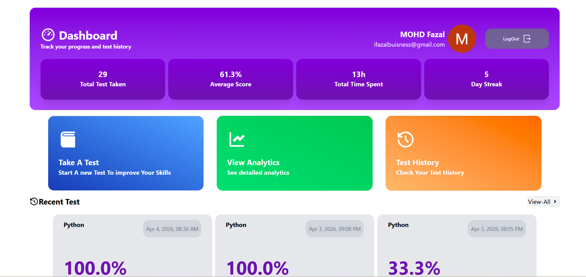
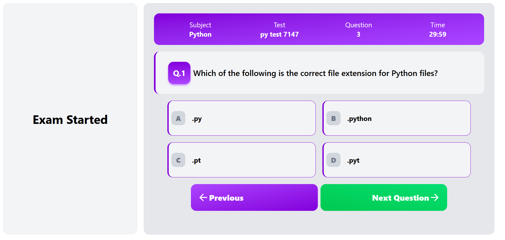
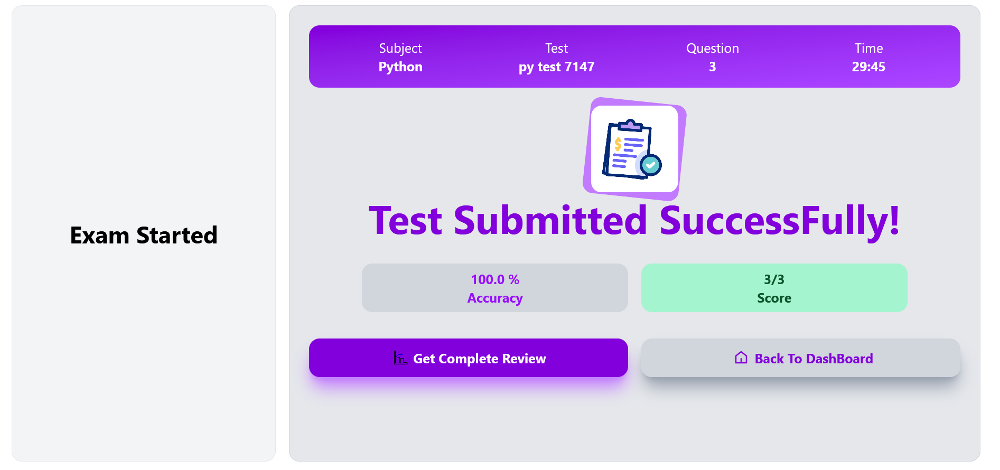

# Do Test (Rebuild Using React)

This is A full Stack MCQ Test Platform , completely build using React Js. 
Features:
1. user can take test 
2. user can view Score 
3. user can look previous test
4. user can view leaderboard 

## Technologies Used In This Application
1. React js
2. React Context API For State Management
3. Tailwind CSS
4. Vite 
## Live URL
use the following link to Access My website
[Link](https://imfazal0.github.io/doTestReact/)

## Screenshots

## Other Common Github Profile Sections
👩‍💻 I'm currently learning Redux ToolKit For React

🤔 I'm BCA underGraduate

😄 FrontEnd Web and App Development 

⚡️ Fun fact : You Can Follow Me 😂😂 on Instagram

# 📫 How to reach me...
[Instagram](https://www.instagram.com/imfazal0/)

[Whatsapp](https://wa.link/934ch1)

[Telegram](https://t.me/Imfazal0)
